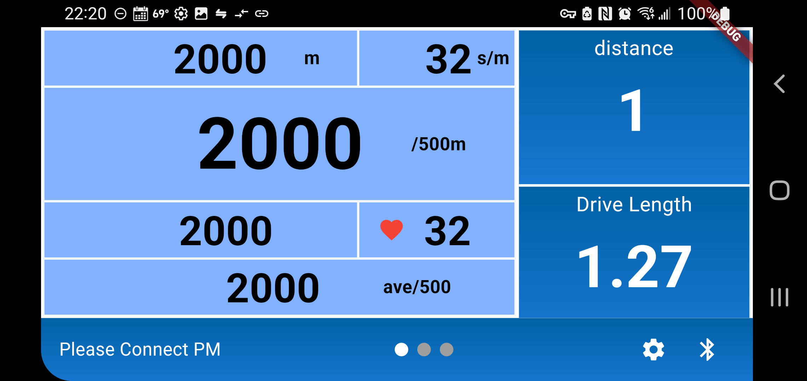

# openergview

An open source Flutter app for viewing data from a Concept2 indoor rowing machine. Inspired by the original ErgData app.

This is a project that is created as a more advanced demo application for showing off the behavior of the `c2bluetooth` library. This is a library that aims to make it easy for developers to build flutter apps that integrate with the data from Concept2 PM5 rowing machines

## Building
Build process is just like any flutter app

Tested primarily on Android and Linux. Results on other platforms may vary.